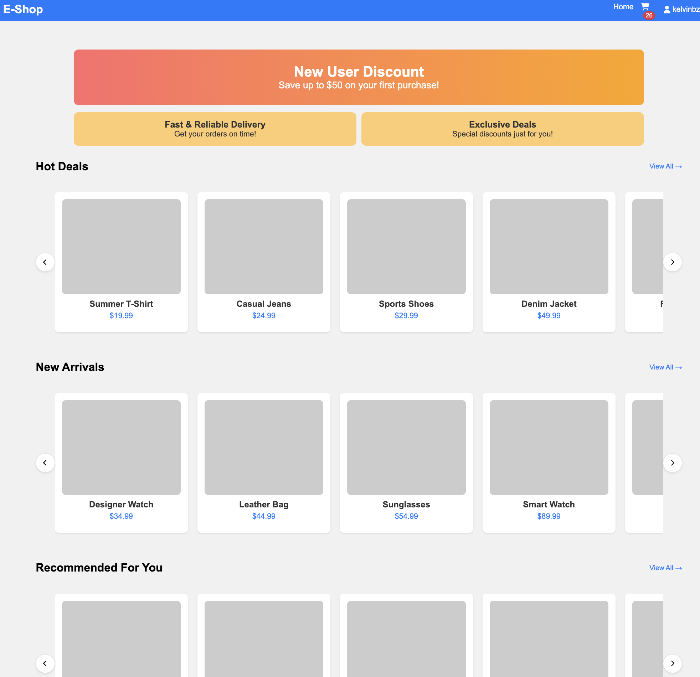
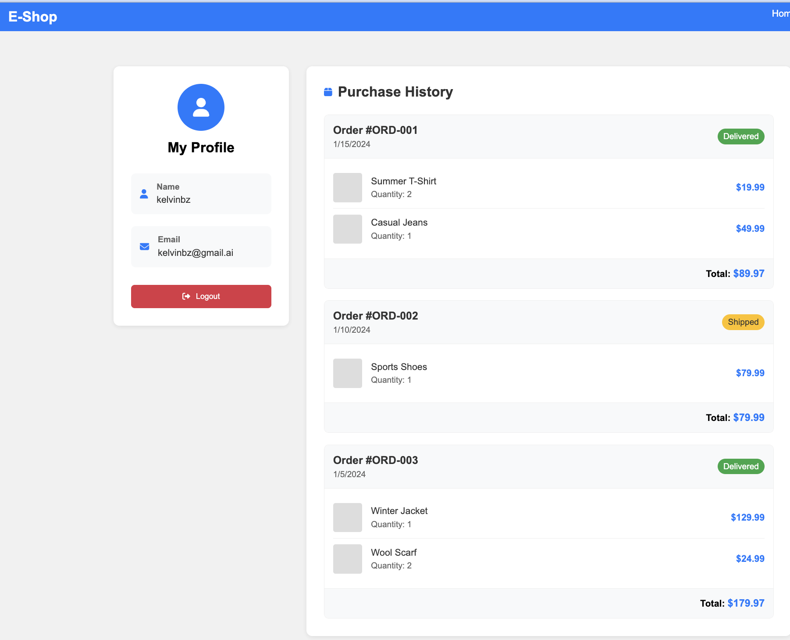

# E-Commerce React App  





A **React-based** e-commerce template featuring product browsing, cart management, fake authentication, and a simple checkout flow.  

## Features  
✅ **Home Page** – Displays banner, hot deals, new arrivals, and recommendations.  
✅ **Product Details** – Shows product info, quantity selector, "You May Also Like" section.  
✅ **Cart** – View added items, update quantity, remove products.  
✅ **Collections** – Browse products by collection (`/collections/:id`).  
✅ **Fake Login** – Any email/password logs in, shows username in navbar.  
✅ **Profile Page** – Displays user info and logout option.  

## Tech Stack  
🔹 React + React Router  
🔹 Context API (Cart, Auth)  
🔹 CSS Modules  

## Installation  
```bash
git clone https://github.com/your-username/ecommerce-react-app.git  
cd ecommerce-react-app  
npm install  
npm start  
```
Runs at **http://localhost:3000/**.  

## Project Structure  
```
src  
├── components/ (Navbar, Footer, ProductCard, etc.)  
├── context/ (AuthContext, CartContext)  
├── pages/ (Home, ProductDetails, Cart, Login, Profile)  
├── App.js (Main Routes)  
└── index.js (Entry Point)  
```

## Usage  
- **Login:** Use any email/password.  
- **Profile:** View user info, logout.  
- **Product Details:** Adjust quantity, add to cart.  
- **Cart:** Edit items, click to view product details.  

## Scripts  
| Command          | Description |  
|-----------------|----------------------|  
| `npm start`    | Run in development mode |  
| `npm run build` | Build for production  |  

## License  
Feel free to modify and use this project. 🚀 Happy coding!